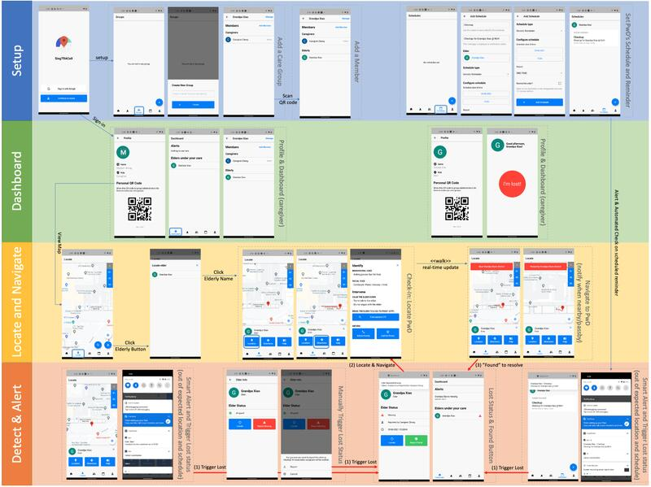

# [Lost-and-Found] Localisation, Prediction and Intervention for People with Dementia

## About Project 
**Description:** developed an data-driven indoor localization system using Wi-Fi and Bluetooth signals combined with deep learning to achieve accurate real-time tracking. It incorporates generative adversarial networks (GANs) to generate synthetic data, significantly reducing the need for manual data collection by 50%. The system includes a client-server web app and mobile application designed to detect wandering behaviors in people living with dementia, enabling monitoring in both indoor and outdoor environments.

**Key Features:** 
- High-accuracy AI-based indoor localization using RSS data and feature engineering
- Synthetic data generation with novel GANs method to accelerate training
- Proof-of-concept deployment including web and mobile apps for dementia wandering detection
- User-centered design with input from healthcare professionals, in collabroation with social scientists

## Program Walk-Through

## Key Technologies & Expertise
- Generative Adversarial Networks (GANs)
- Indoor Localization, Deep Learning, Real-Time Data Processing
- IoT (WiFi, Bluetooth)
- Innovation, Patent Filing & Proof-of-Concept
- Productization & Deployment
- Healthcare Technology

## Awards 
* [Best Paper Award](https://www.ntu.edu.sg/computing/news-events/news/detail/best-paper-at-platcon-2022) at PlatCon2022, titled "Design Principles and considerations for a Localisation Application for Caregivers of People with Dementia"

## Selected Publications
* **S. Yean**, W. Goh, B. S. Lee, and H. L. Oh, “extendGAN+: Transferable Data Augmentation Framework using WGAN-GP for Data-Driven Indoor Localisation Model”, MDPI Sensors, Multi Sensors for Indoor Localization and Tracking, 2023.
* J. Teo, **S. Yean**, Bo. Z Lim, B. S. Lee, and H. L. Oh, “SingTRACeX: Navigation System to Address Wandering behavior for Elders and their Caregivers”, International Conference on Informatics Revolution for Smarter Healthcare (IRSH), 2021.